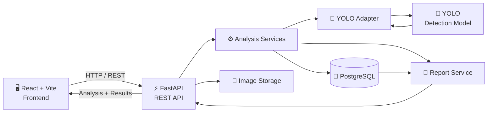
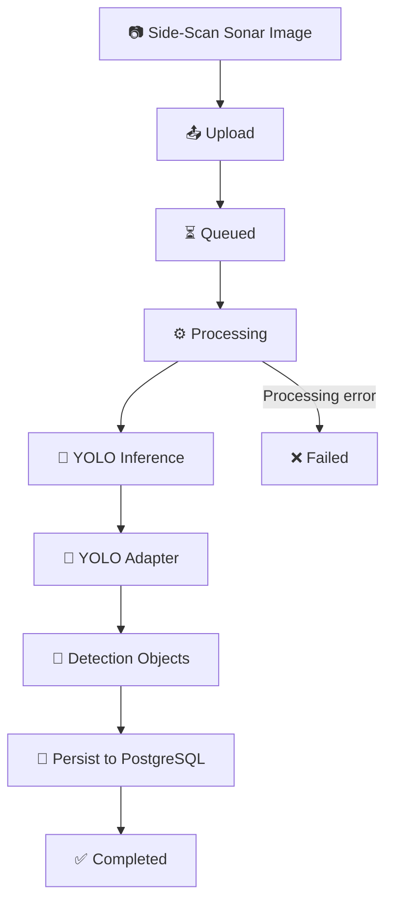
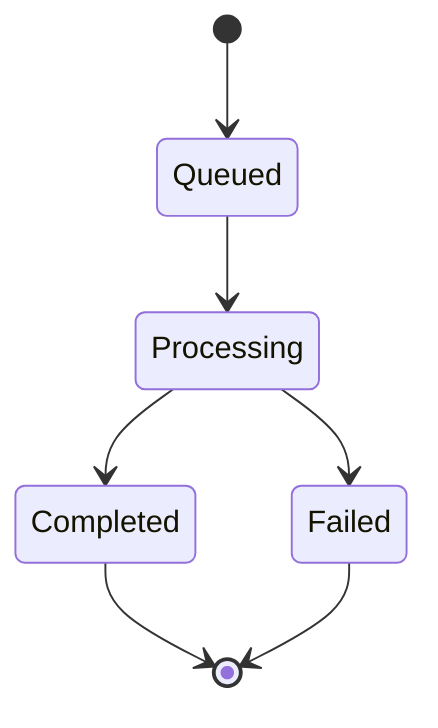
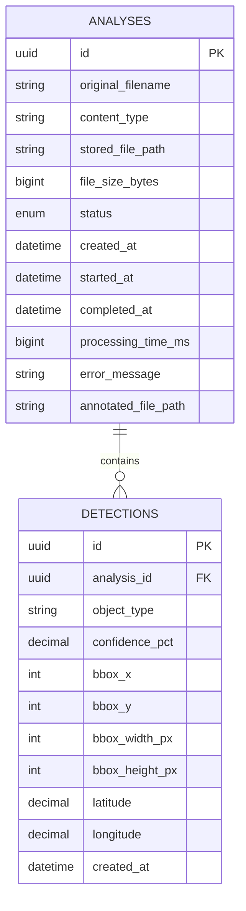
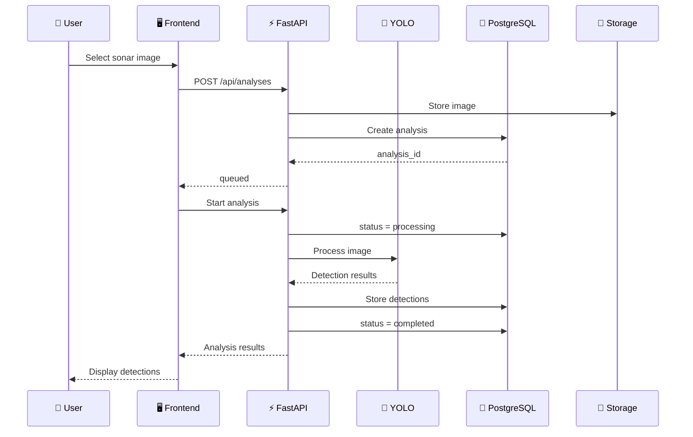

<div align="center">

# 🌊 AquaScan AI

### AI-Powered Underwater Marine Debris & Anomaly Detection System

**Smart India Hackathon 2026 · SIH26057**

<p>
  
  
  
  
  
  
</p>

<p>
  <strong>Transforming side-scan sonar imagery into structured marine-debris and underwater-anomaly intelligence.</strong>
</p>

<br>

[🚀 Overview](#-overview) ·
[🧠 Architecture](#-system-architecture) ·
[⚙️ Technology](#️-technology-stack) ·
[🔌 API](#-rest-api) ·
[🗄️ Database](#️-database-design) ·
[🛣️ Roadmap](#️-roadmap)

</div>

---

## 🌊 Overview

**AquaScan AI** is a full-stack intelligent sonar-analysis platform being developed for **Smart India Hackathon 2026 Problem Statement SIH26057**.

The system is designed to automatically analyze **side-scan sonar imagery** and identify underwater marine debris and anomalies using a YOLO-based detection pipeline.

Instead of treating an image as an isolated prediction, AquaScan AI creates a complete **analysis record** around every sonar image.

Each analysis can contain:

- 📷 Original sonar imagery
- 🤖 AI-generated detections
- 🎯 Confidence scores
- 📐 Bounding-box geometry
- 🌍 Optional geographic coordinates
- ⏱️ Processing timestamps
- 📊 Processing duration
- ❌ Failure information
- 📄 Structured analysis reports

### The core workflow

```text
        SONAR IMAGE
             │
             ▼
      ┌─────────────┐
      │    UPLOAD   │
      └──────┬──────┘
             │
             ▼
      ┌─────────────┐
      │   FASTAPI   │
      └──────┬──────┘
             │
             ▼
      ┌─────────────┐
      │    YOLO     │
      │  DETECTION  │
      └──────┬──────┘
             │
             ▼
      ┌─────────────┐
      │  STRUCTURED │
      │  DETECTIONS │
      └──────┬──────┘
             │
             ▼
      ┌─────────────┐
      │ POSTGRESQL  │
      └──────┬──────┘
             │
             ▼
      ┌─────────────┐
      │  RESULTS &  │
      │   REPORTS   │
      └─────────────┘
```

---

## 🎯 Problem Statement

### SIH26057

> **AI-Powered Automated Underwater Marine Debris and Anomaly Detection System using Side-Scan Sonar Imagery**

Underwater environments can contain marine debris, abandoned objects and other anomalies that are difficult and time-consuming to identify manually from large sonar datasets.

AquaScan AI addresses this challenge by building a modular pipeline capable of:

**Sonar Image → AI Detection → Structured Storage → Visualization → Reporting**

The architecture is designed so that the AI detection layer, backend, database and frontend can evolve independently.

---

## 💡 What AquaScan AI Provides

| Capability | Description |
|---|---|
| 📤 Image Upload | Accept sonar images through a REST API |
| 🧠 AI Detection | Integrate YOLO-based object/anomaly detection |
| 🎯 Confidence | Preserve model confidence for every detection |
| 📐 Bounding Boxes | Store detection coordinates and dimensions |
| 🌍 Geolocation | Support optional latitude and longitude |
| 🔄 Processing Lifecycle | Track queued, processing, completed and failed analyses |
| 🗄️ Persistence | Store analysis and detection information in PostgreSQL |
| 📊 Reporting | Generate structured analysis reports |
| 🔌 REST API | Provide a clean contract between frontend and backend |
| 🧩 Modular Architecture | Separate AI, business logic, database and presentation layers |

---

# 🧠 System Architecture



### Architecture philosophy

AquaScan AI deliberately separates responsibilities:

```text
┌──────────────────────────────────────────────────────────┐
│                       FRONTEND                            │
│                 React + Vite + UI                         │
└──────────────────────────┬───────────────────────────────┘
                           │ REST
                           ▼
┌──────────────────────────────────────────────────────────┐
│                       BACKEND                             │
│                     FastAPI                               │
│                                                          │
│   Routes → Services → Schemas → Database                 │
└───────────────┬───────────────────────┬──────────────────┘
                │                       │
                ▼                       ▼
        ┌───────────────┐       ┌────────────────┐
        │   YOLO AI     │       │  PostgreSQL    │
        │    Adapter    │       │    Database    │
        └───────┬───────┘       └────────────────┘
                │
                ▼
        ┌───────────────┐
        │  YOLO Model   │
        └───────────────┘
```

This makes it possible to replace or improve the AI model without redesigning the API or database layer.

---

# 🤖 AI Detection Pipeline



### Detection transformation

The backend does not depend directly on the internal representation of the YOLO model.

For example:

```text
YOLO output
────────────────────────
class       → Ghost Net
confidence  → 0.87
bbox        → (120, 80, 265, 162)
```

is transformed into:

```text
Backend representation
────────────────────────
object_type     → Ghost Net
confidence_pct  → 87.0
bbox_x          → 120
bbox_y          → 80
bbox_width_px   → 145
bbox_height_px  → 82
```

This adapter boundary keeps the AI implementation isolated from the database/API contracts.

---

# 🔄 Analysis Lifecycle

Every uploaded sonar image follows a controlled processing lifecycle.



| Status | Meaning |
|---|---|
| 🟡 `queued` | Image has been uploaded and is waiting for processing |
| 🔵 `processing` | AI processing is currently underway |
| 🟢 `completed` | Detection results have been stored successfully |
| 🔴 `failed` | Processing encountered an error |

This prevents the frontend and backend from relying on ambiguous processing states.

---

# 🗄️ Database Design

AquaScan AI currently uses a relational PostgreSQL design centered around two core entities:



### `analyses`

Represents a single uploaded sonar image and its processing run.

```text
analyses
│
├── id
├── original_filename
├── content_type
├── stored_file_path
├── file_size_bytes
├── status
├── created_at
├── started_at
├── completed_at
├── processing_time_ms
├── error_message
└── annotated_file_path
```

### `detections`

Represents an individual detected object or anomaly.

```text
detections
│
├── id
├── analysis_id
├── object_type
├── confidence_pct
├── bbox_x
├── bbox_y
├── bbox_width_px
├── bbox_height_px
├── latitude
├── longitude
└── created_at
```

### Relationship

```text
                 ┌────────────────────┐
                 │      ANALYSIS      │
                 │                    │
                 │ UUID id            │
                 │ status             │
                 │ sonar image        │
                 └─────────┬──────────┘
                           │
                           │ 1 : N
                           │
             ┌─────────────┼─────────────┐
             ▼             ▼             ▼
      ┌────────────┐ ┌────────────┐ ┌────────────┐
      │ DETECTION  │ │ DETECTION  │ │ DETECTION  │
      │            │ │            │ │            │
      │ object     │ │ object     │ │ object     │
      │ confidence │ │ confidence │ │ confidence │
      │ bbox       │ │ bbox       │ │ bbox       │
      │ location   │ │ location   │ │ location   │
      └────────────┘ └────────────┘ └────────────┘
```

### Database integrity

The database enforces constraints for:

- Confidence: `0–100`
- Latitude: `-90–90`
- Longitude: `-180–180`
- Bounding-box coordinates: non-negative
- Bounding-box width: greater than zero
- Bounding-box height: greater than zero
- Detection → Analysis foreign-key relationship
- Cascade deletion of detections when an analysis is deleted

---

# ⚙️ Technology Stack

## Frontend

| Technology | Purpose |
|---|---|
| ⚛️ React | Interactive application interface |
| ⚡ Vite | Frontend development and build tooling |
| 🟨 JavaScript / JSX | Application logic |
| 🎨 CSS | User interface styling |

## Backend

| Technology | Purpose |
|---|---|
| 🐍 Python | Backend programming language |
| ⚡ FastAPI | REST API framework |
| 📦 Pydantic | Request/response validation |
| 🗃️ SQLAlchemy 2 | ORM and database access |
| 🔄 Alembic | Database migrations |
| 🐘 Psycopg 3 | PostgreSQL driver |
| 🚀 Uvicorn | ASGI server |
| 📤 python-multipart | Multipart image uploads |

## AI

| Technology | Purpose |
|---|---|
| 🤖 YOLO | Object/anomaly detection |
| 🧩 YOLO Adapter | Converts model output into backend structures |

## Database

| Technology | Purpose |
|---|---|
| 🐘 PostgreSQL | Persistent relational storage |
| 🔑 UUID | Analysis and detection identifiers |
| 📁 File Storage | Original/processed image storage |

---

# 🔌 REST API

The backend exposes an analysis-oriented REST API.

| Method | Endpoint | Purpose |
|:---:|---|---|
| `POST` | `/api/analyses` | Upload sonar image and create analysis |
| `POST` | `/api/analyses/{analysis_id}/start` | Start processing |
| `POST` | `/api/analyses/{analysis_id}/detections` | Submit detections and complete analysis |
| `GET` | `/api/analyses/{analysis_id}` | Retrieve analysis and detections |
| `POST` | `/api/analyses/{analysis_id}/fail` | Mark processing as failed |
| `GET` | `/api/analyses/{analysis_id}/report` | Generate structured report |
| `GET` | `/health` | Backend health check |

---

## 📤 Upload Sonar Image

```http
POST /api/analyses
Content-Type: multipart/form-data
```

Supported image formats:

```text
PNG
JPEG / JPG
TIFF
```

The backend:

1. Validates the uploaded file.
2. Generates a UUID-based storage filename.
3. Stores the image.
4. Creates an analysis record.
5. Sets its initial state to `queued`.

---

## ▶️ Start Analysis

```http
POST /api/analyses/{analysis_id}/start
```

Transitions:

```text
queued
   ↓
processing
```

The backend records the processing start timestamp.

---

## 🎯 Submit Detections

```http
POST /api/analyses/{analysis_id}/detections
```

Example:

```json
{
  "detections": [
    {
      "object_type": "Ghost Net",
      "confidence_pct": 92.0,
      "bbox_x": 120,
      "bbox_y": 80,
      "bbox_width_px": 145,
      "bbox_height_px": 82,
      "latitude": 18.5234,
      "longitude": 72.8456
    }
  ]
}
```

The backend stores the detections and transitions the analysis to:

```text
processing
     ↓
completed
```

---

## 📊 Retrieve Analysis

```http
GET /api/analyses/{analysis_id}
```

Returns:

- Analysis metadata
- Processing status
- Timing information
- Error information where applicable
- Detection records

---

## ❌ Failure Handling

```http
POST /api/analyses/{analysis_id}/fail
```

An error is stored against the analysis while preserving the uploaded image and any existing information.

Example:

```json
{
  "error_message": "YOLO processing failed"
}
```

---

## 📄 Reports

```http
GET /api/analyses/{analysis_id}/report
```

The report service transforms the analysis and its detections into a structured response suitable for frontend presentation or future export functionality.

---

# 📁 Project Structure

```text
AltCtrlElite_SonarDebrisDetection/
│
├── 📁 src/
│   ├── pages/
│   ├── components/
│   └── ...
│
├── 📁 backend/
│   │
│   ├── 📁 app/
│   │   ├── 📁 api/
│   │   │   └── routes/
│   │   │       └── analyses.py
│   │   │
│   │   ├── 📁 core/
│   │   │   └── config.py
│   │   │
│   │   ├── 📁 db/
│   │   │   ├── base.py
│   │   │   └── session.py
│   │   │
│   │   ├── 📁 models/
│   │   │   ├── analysis.py
│   │   │   └── detection.py
│   │   │
│   │   ├── 📁 schemas/
│   │   │   ├── analysis.py
│   │   │   ├── detection.py
│   │   │   └── report.py
│   │   │
│   │   ├── 📁 services/
│   │   │   ├── analysis_service.py
│   │   │   ├── file_storage.py
│   │   │   ├── report_service.py
│   │   │   └── yolo_adapter.py
│   │   │
│   │   └── main.py
│   │
│   ├── 📁 alembic/
│   │   └── versions/
│   │
│   ├── 📁 storage/
│   │   └── uploads/
│   │
│   ├── requirements.txt
│   ├── alembic.ini
│   └── .env.example
│
├── 📄 index.html
├── 📄 package.json
├── 📄 vite.config.js
└── 📄 README.md
```

---

# 🧩 Backend Design

The backend follows a layered structure:

```text
                 HTTP REQUEST
                      │
                      ▼
              ┌───────────────┐
              │ FastAPI Route │
              └───────┬───────┘
                      │
                      ▼
              ┌───────────────┐
              │    Schema     │
              │  Validation   │
              └───────┬───────┘
                      │
                      ▼
              ┌───────────────┐
              │    Service    │
              │ Business Logic│
              └───────┬───────┘
                      │
             ┌────────┴────────┐
             ▼                 ▼
      ┌──────────────┐  ┌──────────────┐
      │  SQLAlchemy  │  │ YOLO Adapter │
      └──────┬───────┘  └──────┬───────┘
             │                 │
             ▼                 ▼
       PostgreSQL          YOLO Model
```

This structure keeps:

- API handling
- validation
- business logic
- database access
- file storage
- AI integration

separated from one another.

---

# 🧪 Backend Verification

The current backend foundation has been verified across the primary analysis lifecycle.

### Verified

- [x] FastAPI application startup
- [x] `/health` endpoint
- [x] Sonar image upload
- [x] Database persistence
- [x] Analysis creation
- [x] `queued → processing`
- [x] Detection submission
- [x] Detection persistence
- [x] Empty-detection completion
- [x] `processing → completed`
- [x] Failure handling
- [x] `processing → failed`
- [x] Processing-time calculation
- [x] Analysis retrieval
- [x] Report generation
- [x] Invalid analysis handling
- [x] Database constraints
- [x] YOLO adapter conversion
- [x] Alembic migration

---

# 📊 Data Flow



---

# 📦 What Gets Stored?

| Category | Stored Information |
|---|---|
| 📷 Image | Filename, MIME type, storage path, file size |
| 🔄 Lifecycle | Status and timestamps |
| ⏱️ Performance | Processing duration |
| ❌ Errors | Processing failure message |
| 🎯 Detection | Object type and confidence |
| 📐 Geometry | Bounding-box position and dimensions |
| 🌍 Location | Optional latitude and longitude |
| 🔗 Relationship | Detection → Analysis |

---

# 🔐 Configuration & Security

Environment-specific configuration is kept outside the repository.

Example:

```env
DATABASE_URL=postgresql+psycopg://<user>:<password>@localhost:5432/<database>
```

### Important

```text
.env
```

should **never** be committed to Git.

The repository provides:

```text
backend/.env.example
```

as the configuration template.

---

# ⚡ Getting Started

## 1. Clone the repository

```bash
git clone https://github.com/SayakDeshpande/AltCtrlElite_SonarDebrisDetection.git

cd AltCtrlElite_SonarDebrisDetection
```

---

## 2. Frontend

Install dependencies:

```bash
npm install
```

Start the development server:

```bash
npm run dev
```

---

## 3. Backend Environment

Navigate to the backend:

```bash
cd backend
```

Create a virtual environment:

```bash
python -m venv .venv
```

### Windows PowerShell

```powershell
.\.venv\Scripts\Activate.ps1
```

### macOS / Linux

```bash
source .venv/bin/activate
```

Install dependencies:

```bash
pip install -r requirements.txt
```

---

## 4. Configure PostgreSQL

Create a PostgreSQL database and configure:

```text
backend/.env
```

using:

```text
backend/.env.example
```

Example:

```env
DATABASE_URL=postgresql+psycopg://<user>:<password>@localhost:5432/<database>
```

---

## 5. Run Database Migrations

From the `backend` directory:

```bash
alembic upgrade head
```

---

## 6. Start FastAPI

```bash
uvicorn app.main:app --reload
```

Once running, the backend exposes FastAPI's automatically generated API documentation.

---

# 🧭 Development Roadmap

### Backend & Database

- [x] PostgreSQL database design
- [x] SQLAlchemy models
- [x] Alembic migration
- [x] FastAPI foundation
- [x] Image upload API
- [x] Analysis lifecycle
- [x] Detection persistence
- [x] Failure handling
- [x] Report API
- [x] YOLO adapter boundary

### Integration

- [ ] Connect live YOLO inference to backend
- [ ] Connect frontend to REST API
- [ ] Replace frontend mock detection data
- [ ] Complete end-to-end analysis flow
- [ ] Display real detection bounding boxes
- [ ] Persist and display real geographic coordinates

### Production

- [ ] Production configuration
- [ ] Deployment
- [ ] Authentication / authorization
- [ ] Improved observability and logging
- [ ] Production image storage
- [ ] Performance optimization
- [ ] Automated CI/CD

---

# 📸 Application Preview

> Screenshots will be added as the frontend and backend integration reaches the next milestone.

### 🔍 Sonar Analysis

```text
┌─────────────────────────────────────────────────────────┐
│                  AQUASCAN AI                            │
│                                                         │
│     Upload → Analyze → Detect → Report                 │
│                                                         │
│              [ Sonar Image Preview ]                    │
│                                                         │
│                 ┌──────────┐                            │
│                 │ Detection│                            │
│                 │ 92.0%    │                            │
│                 └──────────┘                            │
│                                                         │
└─────────────────────────────────────────────────────────┘
```

### 📊 Detection Results

The final integrated interface will expose:

- Detected object class
- Confidence
- Bounding box
- Coordinates
- Processing status
- Analysis metadata

---

# 🧠 Engineering Principles

AquaScan AI is being developed around several core principles.

### 01 · Modularity

AI, backend, database and frontend components are separated so that each layer can evolve independently.

### 02 · Data Integrity

Important constraints are enforced at the database and API levels instead of relying entirely on frontend validation.

### 03 · Traceability

Every analysis has its own UUID and lifecycle, allowing individual processing runs to be tracked.

### 04 · Extensibility

The YOLO adapter provides a stable boundary for future model changes.

### 05 · API-First Design

The backend exposes structured REST endpoints so different clients can consume the same analysis system.

---

# 🌐 Future Vision

The long-term architecture can evolve beyond a basic image-to-detection workflow.

Potential future capabilities include:

```text
                    AQUASCAN AI
                         │
          ┌──────────────┼──────────────┐
          │              │              │
          ▼              ▼              ▼
     🤖 AI Models    🗺️ Geospatial    📊 Analytics
          │              │              │
          ▼              ▼              ▼
      Detection      Sonar Mapping    Statistics
          │              │              │
          └──────────────┼──────────────┘
                         │
                         ▼
                  🌊 Marine Intelligence
```

The architecture can eventually support:

- Multiple detection models
- Larger sonar datasets
- Geospatial visualization
- Detection analytics
- Historical analysis
- Dataset management
- Automated reporting
- Deployment on research infrastructure

---

# 👥 Team

<div align="center">

### Built by **AltCtrlElite**

For **Smart India Hackathon 2026 · SIH26057**

</div>

The project is developed collaboratively across:

| Area | Responsibility |
|---|---|
| 🎨 Frontend | React-based user interface |
| ⚙️ Backend | FastAPI REST services |
| 🗄️ Database | PostgreSQL + SQLAlchemy + Alembic |
| 🤖 AI | YOLO detection pipeline |
| 🔗 Integration | Frontend ↔ Backend ↔ AI |

---

# 📚 Documentation

| Resource | Description |
|---|---|
| `README.md` | Complete project overview |
| `backend/README.md` | Backend/database documentation |
| FastAPI OpenAPI | Interactive API documentation |
| Alembic | Database migration system |

---

# 📜 License

This repository is currently developed as a **Smart India Hackathon 2026 project**.

Licensing and redistribution terms will be finalized by the project team.

---

<div align="center">

<br>

## 🌊 Detect Deeper. Analyze Smarter. Protect Our Oceans.

### AquaScan AI

**SIH26057 · Smart India Hackathon 2026**

<br>

⭐ If you find this project interesting, consider giving the repository a star.

</div>